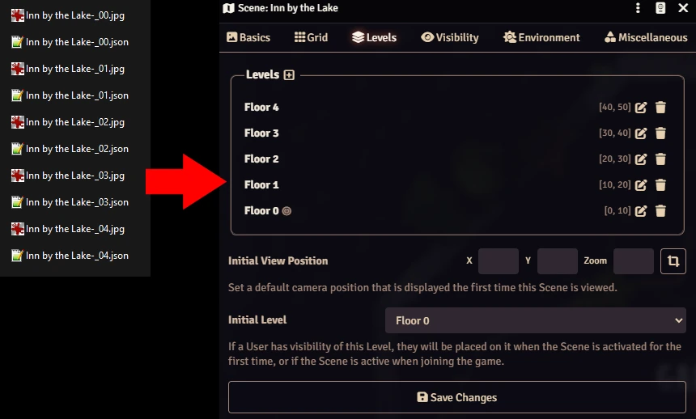
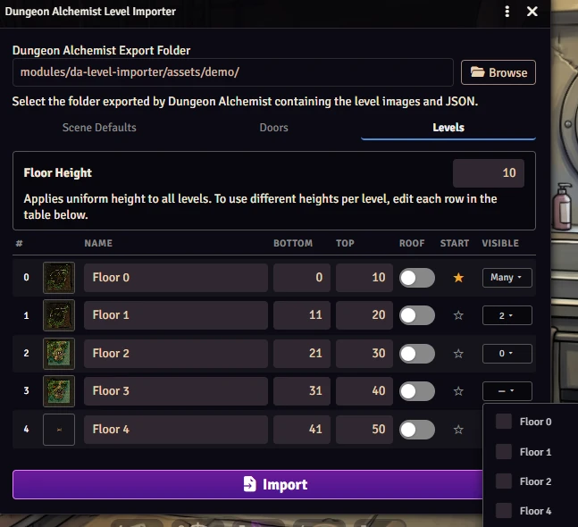

# Dungeon Alchemist Level Importer

Foundry VTT v14 module that imports a Dungeon Alchemist multi-level export and creates a Scene using native v14 Scene Levels.

<p align="center"></p>

[](https://buymeacoffee.com/mestredigital)

# How it Works

Dungeon Alchemist exports multi-floor maps as sibling file pairs — one image and one `.json` data file per floor, named with a numeric suffix (e.g. `TavernMap-_0.jpg`, `TavernMap-_0.json`, `TavernMap-_1.jpg`, `TavernMap-_1.json`). The image can be a static format (`.jpg`, `.jpeg`, `.png`, `.webp`) or an animated video (`.webm`, `.mp4`, `.m4v`); video floors are imported as animated Scene Level backgrounds.

<p align="center"></p>

This module reads all pairs in a folder, parses each JSON for wall, door, and light data, and creates a **single Foundry VTT Scene** where each floor becomes a native **Scene Level** (a feature introduced in Foundry VTT v14). Walls, doors, and lights are bound to their respective level so they only activate when that floor is active — no manual setup required.

## Requirements

- Each export folder must contain **only** the files for a single map. Do not mix exports from different maps in the same folder, as the importer will attempt to pair every image/video file with a sibling `.json` by filename stem.
- Foundry VTT **v14 or later** is required. The native Levels system used here is not available in earlier versions.

## Features

### Importer Dialog (`DA.Importer()`)

The dialog is tabbed and opens when you call `DA.Importer()` from a macro or from the **DA Level Importer** button injected in the Scenes directory sidebar.

#### Scene Defaults tab
- **Copy Images to World** toggle (off by default): copies all floor images into `worlds/<your-world>/da-imported/<map-name>/` and renames them to `kebab-case` for portability.

#### Doors tab
- **Door texture selector** with 25 Foundry canvas door options and a real-time hover preview.
- **Door sound selector** with 21 Foundry door sound options and a play-preview button to audition before import.
- Any wall exported with `door=1` automatically receives the selected texture (with swing animation) and sound key on import.

#### Levels tab
- One row per detected floor showing a thumbnail, an editable name, and editable **bottom / top elevation** inputs.
- **Uniform floor height** field at the top: changing it recalculates all bottom/top inputs at once.
- Per-level **Is Roof** toggle (available on every floor except the first): marks that level as a roof so it renders only when the floor directly below it is active.
- **Visible Levels** column: each row has a dropdown (`— ▾` / `N ▾`) listing all other levels as checkboxes. Checked levels are added to that floor's `visibility.levels` array, controlling which other floors are simultaneously visible when that level is active. If both *Is Roof* and *Visible Levels* are configured, their results are merged (deduplicated) into a single array.

### Region Tool (`DA.AddRegion()`)

Opens a dialog to configure a staircase or elevator transit region spanning multiple consecutive levels. Select a starting level, specify how many levels above and below should share the region, then click on the canvas to place it. A single region document is created and bound to all target levels using native `changeLevel` behavior.

## Usage

Open the importer from the Scenes directory sidebar button or call from a macro:

```js
DA.Importer();
```

Select the folder exported by Dungeon Alchemist, configure the tabs, and click Import. The module creates a single Scene with one native Scene Level per floor, with walls, doors, and lights already bound to their respective levels.

To add a staircase/elevator region to an existing scene:

```js
DA.AddRegion()
```

# 📦 Installation

Install via the Foundry VTT Module browser or use this manifest link:

```javascript
https://raw.githubusercontent.com/brunocalado/da-level-importer/main/module.json
```

# ⚖️ Credits & License

* **Code License:** GNU GPLv3.

* **Demo:** The maps are from Dungeon Alchemist and are under their license: https://www.dungeonalchemist.com/terms-of-use

